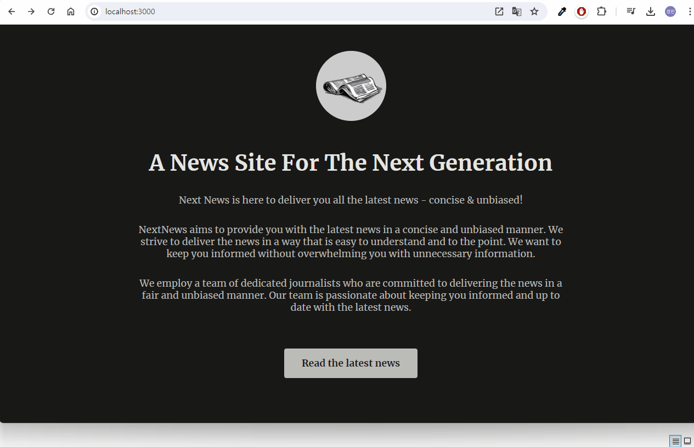

# Routing Page Router Deep Dive

 Nextjs에서 제공하는 라우터 기능 정리 



### 병렬 라우터

렌더링을 병렬로 진행해서 페이지 로딩 시간을 단축시키는 방법을 말한다. 

- [page]와 같이 동적 라우팅이 포함된 경우 모든 병렬 라우터 경로에 동일한 동적 경로를 포함시켜줘야 한다.

- 혹은 default.tsx와 같이 변경되지 않는 페이지를 만들 수 있다.

### Catch-All 라우팅

특정 경로 이하의 모든 경로를 동적으로 처리하는 것을 말한다. Catch-All Routing, Optional Catch-All Routing이 있다.

- Catch-All Routing: `[...slug]`와 같이 설정하고 `/a`, `/a/b`, `/a/b/c`를 처리할 수 있다.

- Optional-Catch-All Routing: `[[...slug]]`와 같이 설정하고 `/`, `/a`, `/a/b`, `/a/b/c`를 모두 처리할 수 있다.

### Server vs Client Component

가급적 서버 컴포넌트를 사용해야 하며, 클라이언트 컴포넌트를 만들게 될 경우 크기를 되도록 작게 하는 것을 권장한다. 

### Intercepting Routing 

접속 경로에 따라 다른 페이지를 보여줄 수 있는 기능 

- 폴더명: `(.){경로}`와 같이 설정한다. 점이 한 개(.)라면 현재 경로, 점이 두 개라면(..) 상위 경로를 기준으로 한다. cf. (..)(..), (...)도 존재, 공식 문서를 참고할 것  
  
  ex) `(.)image`

### 병렬 라우터와 라우터 가로채기 기능의 사용 → `모달` 구현

news/[slug] 참고하기

페이지가 열리게 되면 modal(@modal), background(page) 화면이 병렬로 렌더링 된다. 모달 창은 기존의 이미지 페이지(image)에서 보여주는 이미지 경로를 가로채 모달 화면을 구현한다. 이때 @modal/page에서는 특별히 보여야 하는 화면이 없으므로 return null 처리를 해준다. 

### useRouter

next/navigation에서 제공하는 메서드로 라우터 객체에 엑세스 권한을 부여한다. useRouter를 이용해 모달 창 밖을 클릭했을 때 모달창 종료를 구현할 수 있다.

```tsx
const router = useRouter();

return (
  <div onClick={router.back}>
    ...
  </div>
)
```

### Route Group: 경로 그룹

경로 그룹은 전용 레이아웃을 설정할 수 있는 장점이 있다. 

- `({경로명})`과 같이 괄호로 폴더명을 감싸서 설정한다

### Route Handler: 경로 처리기 

- api 폴더에 route.ts와 같이 설정된 폴더명을 통해 데이터를 송수신 할 수 있다

### 미들웨어

- app 대신에 루트 경로에 파일을 만들어 사용할 수 있다

- 수신 요청을 보고 정보를 변경하거나 차단하는 기능을 수행할 수 있다.
 
- 실행되는 모든 요청에 대해 확인이 가능하고, matcher를 통해 특정 경로에 대해서만 미들웨어를 통과하도록 적용하는 것도 가능하다.


